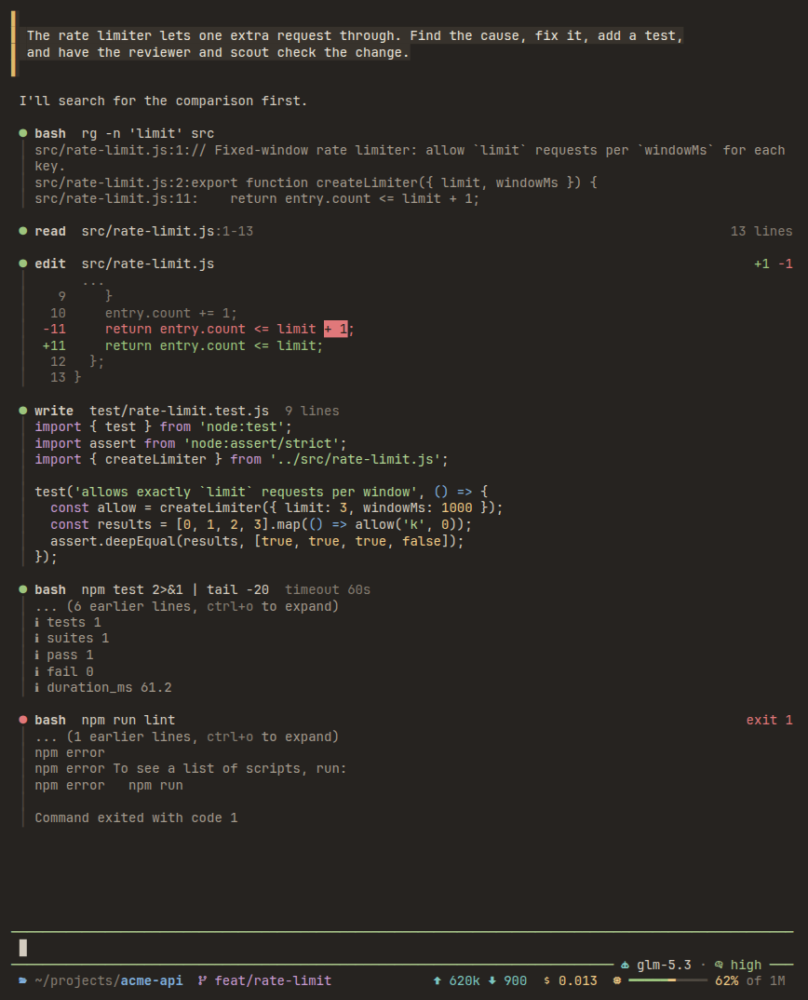
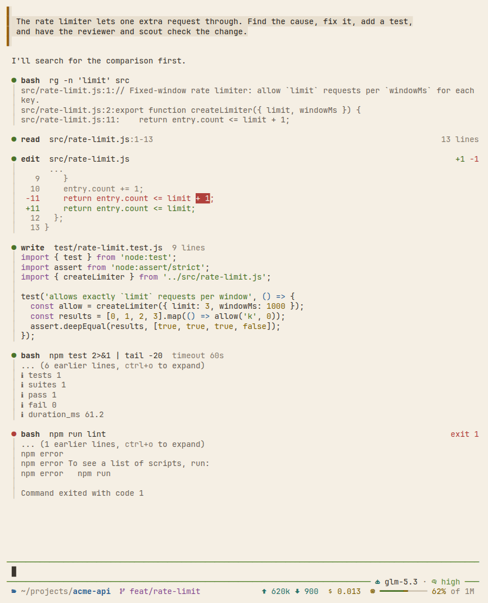
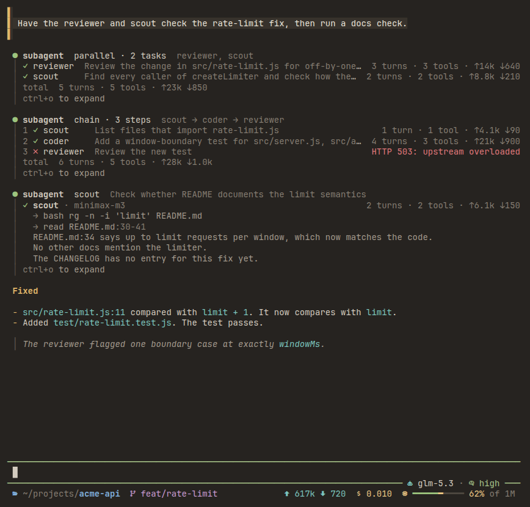

# pi-warm-ui

给 [pi coding agent](https://github.com/earendil-works/pi) 用的暖色低眩光主题，并让对话区更清爽：紧凑的工具行、易读的子代理运行记录、彩色的单行状态栏。

[English](README.md)

| 深色（`eyecare-warm`） | 浅色（`eyecare-warm-light`） |
|---|---|
|  |  |



截图使用 `"icons": "nerd"` 和 JetBrainsMono Nerd Font。

## 包含什么

**两个主题**

- `eyecare-warm`：深色，暖棕底（`#262320`）。
- `eyecare-warm-light`：浅色，暖纸底（`#F5EFE4`）。
- 每个主题只有一个强调色：琥珀色。标题、列表符号和菜单里的选中项用它。
- 正文在所有面板上的对比度不低于 7.9:1，次要文字不低于 4.5:1。
- 输入框边框按思考等级从冷到暖变色：off 灰、low 蓝灰、medium 青、high 草绿、xhigh 麦黄、max 橙。

**工具行**

- 每次工具调用只占一行标题：状态圆点、工具名和一行摘要。输出放在下方的竖线里。

  ```
  ● edit  src/rate-limit.js                          +1 −1 · 0.2s
  │  -11     return entry.count <= limit + 1;
  │  +11     return entry.count <= limit;
  ```

- 圆点颜色表示状态：参数还在生成时是暗色，运行中是琥珀色，完成是绿色，失败是红色。
- 标题右侧显示运行耗时、edit 的增删行数、read 的行数，以及失败命令的退出码。
- shell 命令开头的 `cd <工作目录> &&` 会被省略。工作目录内的路径显示为相对路径。
- 输出内容仍由各工具自己的渲染器生成，所以预览、diff、语法高亮和 `ctrl+o` 展开都照常可用。其他工具（MCP、扩展）也使用同样的标题和竖线。

**子代理运行**

适用于 [pi-code](https://www.npmjs.com/package/pi-code) 的 `subagent` 工具，以及结果结构相同的工具：

- 单个运行显示代理名、模型、用量、最近几次工具调用和回答的前几行。
- 并行和链式运行每个运行占一行：状态、代理名、任务和用量。运行中的行下方显示它最近一次工具调用。失败的行显示错误信息。
- `ctrl+o` 展开所有运行：完整任务、全部工具调用，以及以 Markdown 渲染的回答。

**用户消息**

- 你的消息面板左侧加一条琥珀色竖条，滚动查找时更容易定位。

**状态栏**

- 输入框下边框显示模型和思考等级。在 bash 模式（`!` 或 `!!`）下改为显示 `bash` 或 `bash · no context`。上边框保留 pi 自带的工作状态。
- footer 只占一行，每段使用不同颜色：

  | 内容 | 颜色 |
  |---|---|
  | 目录（上级路径暗色，当前文件夹加粗） | 蓝 |
  | git 分支 | 紫 |
  | 会话名 | 灰 |
  | 输入/输出 token | 青 |
  | 最近一次请求的缓存命中率 | 绿 |
  | 会话费用 | 黄 |
  | 上下文用量条 | 50% 以内绿，70% 以内黄，90% 以内橙，超过 90% 红 |

- 设置 `"icons": "nerd"` 后，每段前面还会加 Nerd Font 图标。
- 终端太窄时，footer 按以下顺序隐藏内容：缓存命中率、会话名、token、用量条、上下文总量、费用。
- 扩展状态（例如 goal、plan mode）显示在第二行。没有状态时不显示这一行。

## 安装

需要 pi 1.0 或更高版本。已在 pi 1.0.2 上测试。

1. 安装这个包：

   ```bash
   pi install git:github.com/szxypi/pi-warm-ui
   ```

   要固定版本，就在后面加 tag：`git:github.com/szxypi/pi-warm-ui@v0.2.0`。

2. 启动 pi。布局立即生效。
3. 打开 `/settings`，选择 **Theme**，再选择 `eyecare-warm` 或 `eyecare-warm-light`。
4. 如果终端字体是 [Nerd Font](https://www.nerdfonts.com/)，新建 `~/.pi/agent/warm-ui.json`，写入 `{ "icons": "nerd" }`，然后运行 `/reload`。

要让主题跟随终端的深浅色，在 `~/.pi/agent/settings.json` 里这样设置：

```json
{ "theme": "eyecare-warm-light/eyecare-warm" }
```

只想在一次会话里试用、不安装：

```bash
pi -e git:github.com/szxypi/pi-warm-ui
```

## 配合终端配色（可选）

pi 不绘制终端背景。终端的背景和调色板与主题一致时效果最好。`terminal/` 目录里有现成的配色方案：

| 文件 | 终端 |
|---|---|
| `terminal/windows-terminal.json` | Windows Terminal。把两个对象复制到 `settings.json` 的 `"schemes"` 里。 |
| `terminal/ghostty-eyecare-warm`、`terminal/ghostty-eyecare-warm-light` | Ghostty。复制到 `~/.config/ghostty/themes/`。 |
| `terminal/kitty-eyecare-warm.conf`、`terminal/kitty-eyecare-warm-light.conf` | kitty。在 `kitty.conf` 里加 `include <文件>`。 |

其他终端按下表设置核心颜色：

| 配色 | 背景 | 前景 | 光标 | 选区 |
|---|---|---|---|---|
| EyeCare Warm | `#262320` | `#D3CBBF` | `#E2B86A` | `#4A443C` |
| EyeCare Warm Light | `#F5EFE4` | `#3B352E` | `#93600F` | `#DCD0BC` |

16 个 ANSI 颜色见 `terminal/windows-terminal.json`。

## 配置

pi 启动时和运行 `/reload` 时，扩展读取 `~/.pi/agent/warm-ui.json`。这个文件可以不建。默认值如下：

```json
{
  "enabled": true,
  "contextMeter": true,
  "hideStatuses": ["pi-code-status"],
  "tools": true,
  "userMessages": true,
  "icons": "unicode"
}
```

| 键 | 作用 |
|---|---|
| `enabled` | 设为 `false` 时保留 pi 自带的 footer 和输入框。 |
| `contextMeter` | 设为 `false` 时只显示上下文百分比，不显示用量条。 |
| `hideStatuses` | footer 不显示的状态键。 |
| `tools` | 设为 `false` 时保留 pi 自带的工具框，包括子代理运行。 |
| `userMessages` | 设为 `false` 时去掉用户消息的竖条。 |
| `icons` | `"nerd"` 使用 Nerd Font 图标。`"unicode"` 使用普通符号和短标签。`"none"` 只用标签。 |

无论怎么设置，主题都照常可用。

`pi-code-status` 默认隐藏。[pi-code](https://www.npmjs.com/package/pi-code) 用这个状态转发 Claude Code 的 `statusLine`，内容和本 footer 的模型、上下文重复。要重新显示它，设置 `"hideStatuses": []`。

如果设置了 `PI_CODING_AGENT_DIR`，扩展从那个目录读取 `warm-ui.json`。

## 命令

| 命令 | 作用 |
|---|---|
| `/warm-ui off` | 恢复 pi 自带的 footer、输入框、工具行和用户消息，直到 pi 退出。 |
| `/warm-ui on` | 重新启用布局。 |
| `/warm-ui` | 显示当前状态。 |

已经显示在屏幕上的工具行保持原样。运行 `/reload` 重新绘制。

## 卸载

```bash
pi remove git:github.com/szxypi/pi-warm-ui
```

如果 `theme` 设置的是本包的主题，卸载后 pi 会回退到 `system` 主题。到 `/settings` 里另选一个主题即可。

## 许可证

[MIT](LICENSE)
