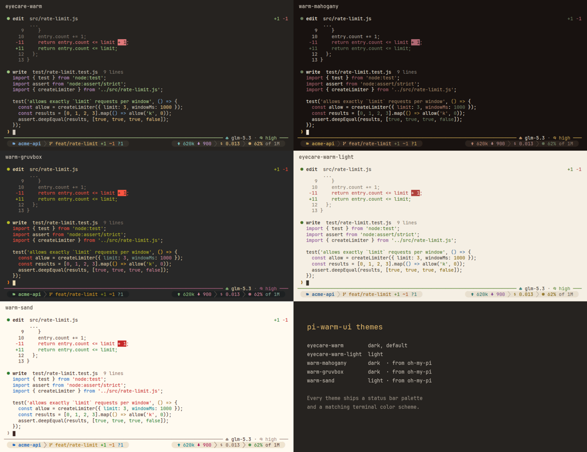

# pi-warm-ui

给 [pi coding agent](https://github.com/earendil-works/pi) 用的暖色低眩光主题，并让对话区更清爽：五个暖色主题、紧凑的工具行、易读的子代理运行记录，以及仿 [oh-my-pi](https://github.com/can1357/oh-my-pi) 风格的状态栏。

[English](README.md)

| 深色（`eyecare-warm`） | 浅色（`eyecare-warm-light`） |
|---|---|
|  |  |




截图使用 `"icons": "nerd"` 和 JetBrainsMono Nerd Font。

## 包含什么

**五个主题**

| 主题 | 风格 | 来源 |
|---|---|---|
| `eyecare-warm` | 深色，暖棕（`#262320`） | 本包 |
| `eyecare-warm-light` | 浅色，暖纸（`#F5EFE4`） | 本包 |
| `warm-mahogany` | 深色，红木（`#181210`） | oh-my-pi `mahogany` |
| `warm-gruvbox` | 深色，gruvbox（`#282828`） | oh-my-pi `dark-gruvbox` |
| `warm-sand` | 浅色，米白（`#FFFAF0`） | oh-my-pi `light-sand` |

- oh-my-pi 自带 100 个主题。这三个是其中对比度最好的暖色主题。它们改了名，颜色也按本包的对比度标准做了调整。
- 标准：正文不低于 7:1；次要文字、代码、diff 和工具输出不低于 4.5:1；状态色不低于 3:1。
- 每个主题都带一套状态栏配色（即 oh-my-pi 的 `statusLine*` 颜色），以及配套的终端配色方案。
- 输入框边框按主题的思考等级颜色变色。

**工具行**

- 每次工具调用只占一行标题：状态圆点、工具名和一行摘要。输出放在下方，缩进到与工具名对齐。

  ```
  ● edit  src/rate-limit.js                          +1 −1 · 0.2s
  │  -11     return entry.count <= limit + 1;
  │  +11     return entry.count <= limit;
  ```

- 圆点颜色表示状态：参数还在生成时是暗色，运行中是琥珀色，完成是绿色，失败是红色。
- 标题右侧显示运行耗时、edit 的增删行数、read 的行数，以及失败命令的退出码。
- shell 命令开头的 `cd <工作目录> &&` 会被省略。工作目录内的路径显示为相对路径。
- 输出内容仍由各工具自己的渲染器生成，所以预览、diff、语法高亮和 `ctrl+o` 展开都照常可用。其他工具（MCP、扩展）也使用同样的标题和缩进输出。

**子代理运行**

适用于 [pi-code](https://www.npmjs.com/package/pi-code) 的 `subagent` 工具，以及结果结构相同的工具：

- 单个运行显示代理名、模型、用量、最近几次工具调用和回答的前几行。
- 并行和链式运行每个运行占一行：状态、代理名、任务和用量。运行中的行下方显示它最近一次工具调用。失败的行显示错误信息。
- `ctrl+o` 展开所有运行：完整任务、全部工具调用，以及以 Markdown 渲染的回答。

**用户消息**

- 你的消息面板左侧加一条琥珀色竖条，滚动查找时更容易定位。
- 隐藏思考内容时（`hideThinkingBlock`），`Thinking...` 行前加一个图标：`"icons": "nerd"` 时是大脑图标，`"unicode"` 时是 `✻`，`"none"` 时不加。

**状态栏**

- 输入框在输入内容前显示提示符 `❯`。换行后的行和补全列表都缩进对齐。bash 模式下提示符变成 bash 颜色。
- 输入框下边框显示模型和思考等级。在 bash 模式（`!` 或 `!!`）下改为显示 `bash` 或 `bash · no context`。上边框保留 pi 自带的工作状态。
- footer 只占一行，分左右两段，参照 oh-my-pi 画成主题状态栏底色上的两枚胶囊：

  ```
   acme-api   feat/rate-limit +1 ~1 ?1                     2  617k  720   0.010   62% of 1M 
  ```

  - 左段：项目目录名（不显示完整路径）和 git 分支。有文件改动时，分支颜色从 clean 色变成 dirty 色。`+` 是已暂存文件数，`~` 是已修改文件数，`?` 是未跟踪文件数，`▴`/`▾` 是领先和落后上游的提交数。
  - 右段：运行中的子代理数（只在运行时显示）、会话名、输入/输出 token、最近一次请求的缓存命中率、会话费用和上下文用量。
  - 上下文百分比 50% 以内绿，70% 以内黄，90% 以内橙，超过 90% 红。
- 每段颜色取自主题的状态栏配色。没有配色的主题从它的标准颜色推导。
- git 状态每 10 秒刷新一次，每轮对话结束后和每次 `bash`、`edit`、`write` 调用后也会刷新。它用 `git status --no-optional-locks`，不会锁住 index。
- 设置 `"icons": "nerd"` 后，各段带 Nerd Font 图标，胶囊两端变成圆角。设置 `"statusBar": "plain"` 后不画底色，只显示彩色文字。
- 终端太窄时，footer 按以下顺序隐藏内容：缓存命中率、会话名、git 计数、token、上下文总量、费用。
- 扩展状态（例如 goal、plan mode）显示在第二行。没有状态时不显示这一行。

## 安装

需要 pi 1.0 或更高版本。已在 pi 1.0.2 上测试。

1. 安装这个包：

   ```bash
   pi install git:github.com/szxypi/pi-warm-ui
   ```

   要固定版本，就在后面加 tag：`git:github.com/szxypi/pi-warm-ui@v0.4.2`。

2. 启动 pi。布局立即生效。
3. 打开 `/settings`，选择 **Theme**，再从五个主题里选一个。
4. 如果终端字体是 [Nerd Font](https://www.nerdfonts.com/)，新建 `~/.pi/agent/warm-ui.json`，写入 `{ "icons": "nerd" }`，然后运行 `/reload`。

要让主题跟随终端的深浅色，在 `~/.pi/agent/settings.json` 里这样设置：

```json
{ "theme": "eyecare-warm-light/eyecare-warm" }
```

只想在一次会话里试用、不安装：

```bash
pi -e git:github.com/szxypi/pi-warm-ui
```

## 配合终端配色（可选）

pi 不绘制终端背景。终端的背景和调色板与主题一致时效果最好。`terminal/` 目录里有现成的配色方案：

| 文件 | 终端 |
|---|---|
| `terminal/windows-terminal.json` | Windows Terminal。把需要的对象复制到 `settings.json` 的 `"schemes"` 里。 |
| `terminal/ghostty-<主题>` | Ghostty。复制到 `~/.config/ghostty/themes/`。 |
| `terminal/kitty-<主题>.conf` | kitty。在 `kitty.conf` 里加 `include <文件>`。 |

其他终端按下表设置核心颜色：

| 配色 | 背景 | 前景 |
|---|---|---|
| EyeCare Warm | `#262320` | `#D3CBBF` |
| EyeCare Warm Light | `#F5EFE4` | `#3B352E` |
| Warm Mahogany | `#181210` | `#ECE4D8` |
| Warm Gruvbox | `#282828` | `#EBDBB2` |
| Warm Sand | `#FFFAF0` | `#3E2723` |

16 个 ANSI 颜色见 `terminal/windows-terminal.json`。

## 配置

pi 启动时和运行 `/reload` 时，扩展读取 `~/.pi/agent/warm-ui.json`。这个文件可以不建。默认值如下：

```json
{
  "enabled": true,
  "hideStatuses": ["pi-code-status"],
  "tools": true,
  "userMessages": true,
  "icons": "unicode",
  "statusBar": "band",
  "prompt": "❯"
}
```

| 键 | 作用 |
|---|---|
| `enabled` | 设为 `false` 时保留 pi 自带的 footer 和输入框。 |
| `hideStatuses` | footer 不显示的状态键。 |
| `tools` | 设为 `false` 时保留 pi 自带的工具框，包括子代理运行。 |
| `userMessages` | 设为 `false` 时去掉用户消息的竖条。 |
| `prompt` | 输入内容前的提示符，例如 `">"` 或 `"›"`。设为 `""` 时不显示。 |
| `icons` | `"nerd"` 使用 Nerd Font 图标。`"unicode"` 使用普通符号和短标签。`"none"` 只用标签。 |
| `statusBar` | `"band"` 在主题的状态栏底色上画 footer。`"plain"` 只显示彩色文字。 |

无论怎么设置，主题都照常可用。

`pi-code-status` 默认隐藏。[pi-code](https://www.npmjs.com/package/pi-code) 用这个状态转发 Claude Code 的 `statusLine`，内容和本 footer 的模型、上下文重复。要重新显示它，设置 `"hideStatuses": []`。

如果设置了 `PI_CODING_AGENT_DIR`，扩展从那个目录读取 `warm-ui.json`。

## 命令

| 命令 | 作用 |
|---|---|
| `/warm-ui off` | 恢复 pi 自带的 footer、输入框、工具行和用户消息，直到 pi 退出。 |
| `/warm-ui on` | 重新启用布局。 |
| `/warm-ui` | 显示当前状态。 |

已经显示在屏幕上的工具行保持原样。运行 `/reload` 重新绘制。

## 卸载

```bash
pi remove git:github.com/szxypi/pi-warm-ui
```

如果 `theme` 设置的是本包的主题，卸载后 pi 会回退到 `system` 主题。到 `/settings` 里另选一个主题即可。

## 致谢

`warm-mahogany`、`warm-gruvbox`、`warm-sand` 三个主题和状态栏设计改编自 [oh-my-pi](https://github.com/can1357/oh-my-pi)（MIT）。见 [THIRD_PARTY_NOTICES.md](THIRD_PARTY_NOTICES.md)。`scripts/import-omp-themes.mjs` 可以从 oh-my-pi 源码重新生成这三个主题。

## 许可证

[MIT](LICENSE)
